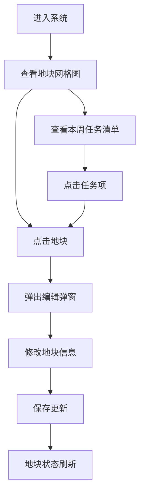

## 1. 产品概述

社区菜园地块认领和维护记录管理系统，为社区菜园管理员提供直观的地块可视化管理界面，支持地块信息编辑、维护任务追踪，帮助高效管理菜园日常运营。

- 主要用途：地块状态可视化、认领信息管理、维护记录追踪
- 目标用户：社区菜园管理员
- 核心价值：通过可视化网格图直观管理地块状态，及时提醒维护任务

## 2. 核心功能

### 2.1 用户角色

| 角色 | 注册方式 | 核心权限 |
|------|----------|----------|
| 管理员 | 系统内置 | 查看所有地块、编辑地块信息、查看维护任务清单 |

### 2.2 功能模块

1. **地块网格图**：以网格形式展示所有地块，显示编号、认领人、种植物、状态
2. **地块信息编辑**：点击地块弹出编辑弹窗，修改地块相关信息
3. **维护任务清单**：展示本周需要浇水或除草的地块列表
4. **状态筛选**：按地块状态筛选显示

### 2.3 页面详情

| 页面名称 | 模块名称 | 功能描述 |
|----------|----------|----------|
| 主页面 | 地块网格图 | 响应式网格布局，显示地块编号、认领人、种植物、最近浇水日期、状态标识 |
| 主页面 | 编辑弹窗 | 点击地块弹出，可编辑认领人、种植物、浇水日期、除草日期、状态等 |
| 主页面 | 任务清单 | 侧边栏/底部面板显示本周需浇水或除草的地块，支持快速跳转 |
| 主页面 | 筛选栏 | 按状态筛选地块（全部/已认领/未认领/需维护） |

## 3. 核心流程

### 3.1 主要用户流程

1. 管理员进入系统，查看整体地块网格图
2. 浏览本周维护任务清单，了解需要处理的地块
3. 点击具体地块查看详情或编辑信息
4. 更新浇水/除草记录后，地块状态自动更新
5. 通过筛选功能快速定位特定状态的地块

## 4. 用户界面设计

### 4.1 设计风格

- **主色调**：自然绿色系 (#2D5A27 深绿、#52B788 翠绿、#95D5B2 浅绿)，体现菜园的自然氛围
- **辅助色**：土壤棕色 (#8B4513)、阳光黄色 (#FFD700)、警示红色 (#E63946)
- **背景色**：米白色 (#FEFAE0)，温暖自然
- **按钮风格**：圆角矩形，微阴影，悬停有轻微上浮效果
- **字体**：标题使用「Noto Serif SC」衬线字体，正文使用「Noto Sans SC」无衬线字体
- **布局风格**：卡片式网格布局，地块卡片有轻微阴影和圆角
- **图标风格**：使用 Emoji 图标（🌱、💧、🌿、👤），自然亲切

### 4.2 页面设计概览

| 页面名称 | 模块名称 | UI 元素 |
|----------|----------|---------|
| 主页面 | 顶部导航 | 系统标题、筛选下拉、任务清单切换按钮 |
| 主页面 | 地块网格 | 响应式卡片网格，状态颜色编码，悬停放大效果 |
| 主页面 | 地块卡片 | 编号标签、认领人头像/名字、种植物emoji、浇水日期、状态角标 |
| 主页面 | 编辑弹窗 | 表单输入框、日期选择器、状态选择、保存/取消按钮 |
| 主页面 | 任务清单 | 侧边滑出面板，任务项带图标和优先级标识 |

### 4.3 响应式设计

- **桌面端**：地块网格 6-8 列，任务清单固定右侧边栏
- **平板端**：地块网格 4-5 列，任务清单可折叠
- **手机端**：地块网格 2-3 列，任务清单改为底部滑出面板，优化触摸交互
- 所有交互元素尺寸不小于 44x44px，适合触摸操作

### 4.4 动效设计

- 页面加载时地块卡片错落淡入
- 悬停地块卡片轻微放大并增加阴影
- 编辑弹窗平滑缩放弹出
- 任务清单侧边滑入/滑出
- 状态变更时有颜色过渡动画
