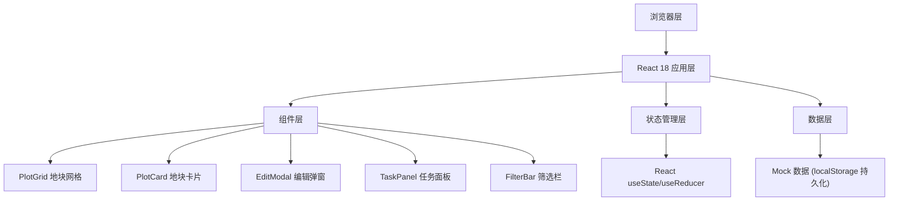

## 1. 架构设计



## 2. 技术选型

- **前端框架**: React@18 + TypeScript
- **构建工具**: Vite@5
- **样式方案**: TailwindCSS@3
- **状态管理**: React Hooks (useState, useReducer, useContext)
- **数据持久化**: localStorage (前端模拟数据存储)
- **图标**: Lucide React + Emoji
- **日期处理**: 原生 Date API

## 3. 目录结构

```
src/
├── components/
│   ├── PlotGrid.tsx      # 地块网格组件
│   ├── PlotCard.tsx      # 地块卡片组件
│   ├── EditModal.tsx     # 编辑弹窗组件
│   ├── TaskPanel.tsx     # 任务面板组件
│   └── FilterBar.tsx     # 筛选栏组件
├── types/
│   └── plot.ts           # 地块相关类型定义
├── data/
│   └── mockData.ts       # 模拟数据
├── hooks/
│   └── usePlots.ts       # 地块管理 Hook
├── utils/
│   └── dateUtils.ts      # 日期工具函数
├── App.tsx
├── main.tsx
└── index.css
```

## 4. 数据模型

### 4.1 地块数据类型定义

```typescript
interface Plot {
  id: string;
  plotNumber: string;      // 地块编号，如 A1, B3
  owner: string | null;    // 认领人
  plant: string | null;    // 种植物
  lastWatered: string | null;  // 最近浇水日期 (ISO 格式)
  lastWeeded: string | null;   // 最近除草日期 (ISO 格式)
  status: 'available' | 'claimed' | 'needsMaintenance';  // 状态
  notes?: string;          // 备注
}

type FilterType = 'all' | 'available' | 'claimed' | 'needsMaintenance';
```

### 4.2 数据持久化

- 使用 localStorage 存储地块数据
- Key: `community-garden-plots`
- 初始加载时从 localStorage 读取，无数据则使用 mock 数据

## 5. 核心功能实现

### 5.1 地块网格展示
- 使用 CSS Grid 实现响应式布局
- 根据屏幕宽度自动调整列数 (2-8 列)
- 每张卡片显示地块核心信息

### 5.2 维护任务判断逻辑
- **需浇水**: 最近浇水日期距离今天 > 3 天 或 未浇水
- **需除草**: 最近除草日期距离今天 > 7 天 或 未除草
- 本周任务：筛选出未来 7 天内需要处理的地块

### 5.3 编辑功能
- 点击地块卡片弹出模态框
- 表单包含：认领人、种植物、浇水日期、除草日期、状态、备注
- 保存后更新 localStorage 并刷新视图

### 5.4 响应式断点
- 手机: < 640px (2列)
- 平板: 640px - 1024px (4列)
- 桌面: 1024px - 1440px (6列)
- 大屏: > 1440px (8列)
